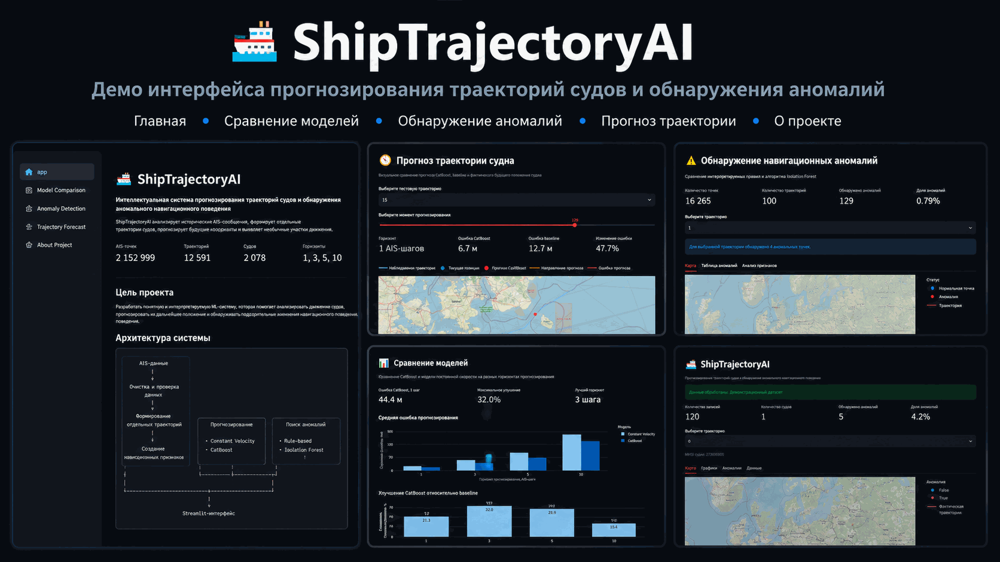

# 🚢 ShipTrajectoryAI

<!-- PROJECT_BADGES_START -->

<!-- PROJECT_BADGES_END -->

> Интеллектуальная система прогнозирования траекторий судов и обнаружения аномального навигационного поведения по AIS-данным.

ShipTrajectoryAI — готовая исследовательская ML-система, которая обрабатывает реальные AIS-сообщения, восстанавливает маршруты судов, прогнозирует их дальнейшее положение и обнаруживает необычные участки движения.

## Demo

---

## Практическая задача

Основной пользователь ShipTrajectoryAI — оператор или аналитик морского движения, который наблюдает за большим количеством судов по AIS-данным.

AIS-сообщения могут содержать единичные скачки координат, дубликаты, пропуски, задержки, временные разрывы и некорректные значения скорости. Такие наблюдения создают информационный шум, но не всегда означают реальное изменение поведения судна.

ShipTrajectoryAI решает две основные задачи:

1. отделяет простые технические выбросы от последовательного движения судна;
2. выявляет устойчивое или статистически необычное отклонение фактического движения от ожидаемой траектории.

Рабочий сценарий системы:

1. загружаются AIS-сообщения;
2. данные очищаются и разделяются на отдельные траектории;
3. рассчитываются навигационные признаки;
4. модель прогнозирует ожидаемое положение судна;
5. прогноз сравнивается с фактическим движением;
6. технические и статистически необычные участки отображаются в интерфейсе;
7. окончательную интерпретацию результата выполняет оператор.

Система не объявляет ситуацию опасной автоматически и не заменяет специалиста. Её задача — сократить объём ручного просмотра и помочь оператору быстрее заметить судно, требующее дополнительного наблюдения.

---

## Основные результаты

| Показатель | Значение |
|---|---:|
| Обработано AIS-точек | 2 152 999 |
| Выделено траекторий | 12 591 |
| Уникальных судов | 2 078 |
| Средняя длина траектории | 171 точка |
| Максимальная длина траектории | 360 точек |
| Горизонты прогнозирования | 1, 3, 5 и 10 шагов |
| Аномалий Isolation Forest | около 1% |

CatBoost превзошёл модель постоянной скорости на всех исследованных горизонтах. Максимальное снижение средней ошибки составило **32% на горизонте 3 AIS-шага**.

---

## Возможности системы

- загрузка и проверка AIS-данных;
- преобразование исходных PKL-файлов;
- очистка координат, времени, скорости и курса;
- разделение данных на отдельные траектории;
- создание пространственных и навигационных признаков;
- прогнозирование будущего положения судна;
- многогоризонтное прогнозирование;
- сравнение CatBoost с физическим baseline;
- поиск известных аномалий по правилам;
- поиск неизвестных аномалий с Isolation Forest;
- интерпретация CatBoost через Feature Importance и SHAP;
- визуализация траекторий, прогнозов и аномалий;
- интерактивное приложение Streamlit.

---

## Постановка задачи

AIS — автоматическая идентификационная система, через которую суда передают информацию о своём движении:

- идентификатор MMSI;
- координаты;
- время сообщения;
- скорость относительно земли SOG;
- курс относительно земли COG;
- тип судна.

Реальные AIS-данные могут содержать пропуски, ошибки координат, временные разрывы и нетипичные изменения движения.

Цель проекта — разработать понятную ML-систему, способную:

1. подготовить исторические AIS-данные;
2. сформировать отдельные маршруты;
3. спрогнозировать будущие координаты;
4. обнаружить аномальное навигационное поведение;
5. визуально и численно объяснить результат.

---

## Архитектура

~~~text
AIS-данные
    |
    v
Загрузка и проверка структуры
    |
    v
Очистка и сортировка
    |
    v
Формирование отдельных траекторий
    |
    v
Создание навигационных признаков
    |
    +--------------------------------+
    |                                |
    v                                v
Прогнозирование                 Поиск аномалий
    |                                |
    + Constant Velocity              + Rule-based
    + CatBoost                       + Isolation Forest
    |                                |
    +----------------+---------------+
                     |
                     v
       Метрики и интерпретация
                     |
                     v
          Streamlit-приложение
~~~

---

## Источник данных и границы оценки

Первоначальная прикладная задача была сформулирована в контексте работы подразделения, связанного с наблюдением за движением судов.

Из-за ограниченного уровня доступа внутренний эксплуатационный датасет предприятия не использовался для обучения и оценки опубликованных моделей. Разработанное решение и материалы проекта были переданы руководителю практики и специалистам отдела разработки для возможного дальнейшего применения на внутренних данных.

Для публичной и воспроизводимой демонстрации использован открытый набор:

**AIS Trajectories from Danish Waters for Abnormal Behavior Detection**

- организация: Technical University of Denmark;
- авторы: Kristoffer Vinther Olesen, Anders Nymark Christensen и Line Katrine Harder Clemmensen;
- DOI: [10.11583/DTU.c.6287841](https://doi.org/10.11583/DTU.c.6287841);
- коллекция: [DTU Data](https://data.dtu.dk/collections/AIS_Trajectories_from_Danish_Waters_for_Abnormal_Behavior_Detection/6287841);
- лицензия данных: CC BY 4.0.

Все численные результаты, приведённые в README, относятся к открытому датасету. Они не являются оценкой качества системы на внутренних данных предприятия.

---

## Данные

В проекте используется набор AIS-траекторий из датских вод, подготовленный для исследований аномального поведения судов.

Исходные данные хранятся в последовательности Pickle-объектов. Для проекта реализован собственный конвертер, который:

1. последовательно считывает все объекты;
2. преобразует каждую траекторию в таблицу;
3. добавляет `trajectory_id`;
4. объединяет траектории;
5. преобразует Unix timestamp в дату и время;
6. сохраняет подготовленный CSV.

Исходный набор не включён в Git-репозиторий из-за большого размера.

---

## Подготовка данных

Во время предобработки выполняются:

- унификация названий столбцов;
- преобразование времени;
- преобразование числовых полей;
- удаление пропущенных координат;
- проверка диапазонов широты и долготы;
- фильтрация невозможной скорости;
- удаление дубликатов;
- сортировка по траектории и времени;
- предотвращение смешивания разных маршрутов одного судна.

Особенно важно, что признаки рассчитываются внутри `trajectory_id`, а не только по `mmsi`. Это исключает ложные скачки между разными маршрутами одного и того же судна.

---

## Навигационные признаки

Для прогнозирования и поиска аномалий рассчитываются:

| Признак | Назначение |
|---|---|
| `latitude` | текущая широта |
| `longitude` | текущая долгота |
| `sog` | скорость относительно земли |
| `cog` | курс относительно земли |
| `speed_change` | изменение скорости |
| `course_change` | минимальное изменение курса |
| `distance_from_previous_km` | расстояние от предыдущей точки |
| `calculated_speed_kmh` | скорость, рассчитанная по координатам |
| `time_delta_seconds` | интервал между AIS-сообщениями |
| `hour` | час наблюдения |
| `day_of_week` | день недели |

### Циклическое кодирование курса

Курс является циклической величиной: направления 1° и 359° почти совпадают, хотя численно отличаются на 358°.

Поэтому для CatBoost используются:

~~~python
course_sin = sin(course)
course_cos = cos(course)
~~~

Аналогично кодируется час суток.

---

## Прогнозирование траекторий

### Constant Velocity / last-displacement baseline

Baseline-модель предполагает, что судно продолжит движение с тем же смещением, которое наблюдалось между двумя последними точками.

Для горизонта `h`:

~~~text
predicted_position =
current_position + last_displacement * h
~~~

Эта модель проста, интерпретируема и служит точкой отсчёта.

### CatBoost

Для каждой будущей точки обучаются две модели:

- прогноз изменения широты;
- прогноз изменения долготы.

Модель предсказывает смещение относительно текущей позиции:

~~~text
predicted_latitude  = latitude  + predicted_delta_latitude
predicted_longitude = longitude + predicted_delta_longitude
~~~

Такой подход лучше соответствует физике движения, чем прогноз абсолютных координат.

---

## Протокол оценки

### Разделение данных

Обучающая и тестовая выборки разделяются по целым `trajectory_id`.

Одна и та же траектория не может одновременно находиться в обучающей и тестовой выборках. Это уменьшает риск data leakage, при котором соседние точки одного маршрута попадают в разные части выборки.

Для воспроизводимости используется фиксированный `random_state = 42`.

### Горизонты прогнозирования

Модель оценивается на нескольких горизонтах:

- 1 AIS-шаг;
- 3 AIS-шага;
- 5 AIS-шагов;
- 10 AIS-шагов.

AIS-шаг означает следующую запись внутри траектории. Интервалы между сообщениями могут различаться, поэтому одинаковое число AIS-шагов не всегда соответствует одинаковому физическому времени.

### Основная метрика

Основная метрика — средняя географическая ошибка прогноза в метрах.

Расстояние между фактической и прогнозируемой координатами рассчитывается с использованием Haversine distance.

### Baseline

CatBoost сравнивается с простым физическим baseline, который продолжает последнее наблюдаемое пространственное смещение судна.

Baseline необходим, чтобы показать, действительно ли ML-модель даёт улучшение по сравнению с простым и интерпретируемым подходом.

---

## Результаты прогнозирования

Средняя географическая ошибка рассчитана по формуле гаверсинуса.

| Горизонт | Constant Velocity | CatBoost | Снижение ошибки |
|---:|---:|---:|---:|
| 1 AIS-шаг | 56,4 м | 44,4 м | 21,3% |
| 3 AIS-шага | 143,8 м | 97,9 м | 32,0% |
| 5 AIS-шагов | 250,6 м | 175,8 м | 29,8% |
| 10 AIS-шагов | 555,7 м | 469,9 м | 15,4% |

### Вывод

CatBoost превосходит baseline на всех исследованных горизонтах.

Наибольший выигрыш получен на горизонтах 3 и 5 AIS-шагов. На горизонте 10 шагов ошибка возрастает из-за накопления неопределённости: судно может изменить скорость или курс.

CatBoost лучше baseline в среднем, но на отдельных точках Constant Velocity может оказаться точнее. Это отображается в интерфейсе и рассматривается как ограничение модели, а не скрывается.

---

## Метрики

Основной опубликованный показатель — средняя географическая ошибка в метрах. Расширенная оценка распределения ошибок требует публикации построчных тестовых предсказаний и поэтому не используется в конкурсной презентации.

Разделение обучающих и тестовых данных выполняется по целым `trajectory_id`. Одна траектория не попадает одновременно в обучение и тестирование.

---

## Обнаружение аномалий

### Rule-based detector

Интерпретируемый метод обнаруживает:

- необычно высокую скорость;
- резкое изменение курса;
- возможный скачок координат;
- большой временной разрыв.

На исследуемой выборке основными срабатываниями были резкие изменения курса свыше установленного порога.

### Isolation Forest

Isolation Forest используется для поиска редких комбинаций признаков без размеченных меток.

Признаки модели:

- SOG;
- изменение скорости;
- изменение курса;
- расстояние между точками;
- расчётная скорость;
- временной интервал.

Модель выделила 162 точки, то есть около 1% анализируемых наблюдений.

Среднее изменение курса:

- нормальные точки — около 1,1°;
- аномальные точки — около 95,4°.

Полученный результат показывает, что среди выделенных наблюдений часто встречаются резкие изменения курса и редкие сочетания навигационных признаков.

Важно: статистическая аномалия не обязательно означает опасное или незаконное поведение. Она указывает на участок, который требует дополнительного анализа.

---

## Интерпретация CatBoost

В проекте используются два способа интерпретации:

1. встроенная важность признаков CatBoost;
2. SHAP.

Наиболее важными оказались:

- направление движения, представленное `course_sin` и `course_cos`;
- скорость SOG;
- текущие координаты;
- параметры предыдущего перемещения.

Это соответствует физическому смыслу задачи: будущее положение судна прежде всего зависит от направления и скорости.

### SHAP

SHAP показывает вклад признаков не только в среднем, но и для отдельных прогнозов.

---

## Сравнение моделей

---

## Важность признаков

---

## Сравнение подходов

| Подход | Что решает | Сильная сторона | Ограничение |
|---|---|---|---|
| Ручной просмотр | анализ движения оператором | экспертное понимание ситуации | трудно масштабировать на большое количество судов |
| Предобработка | удаление очевидных ошибок | уменьшает информационный шум | не определяет сложное поведение |
| Rule-based detector | поиск заранее известных отклонений | понятные условия срабатывания | ограничен установленными правилами |
| Last-displacement baseline | простое продолжение движения | интерпретируемая точка отсчёта | плохо учитывает сложные манёвры |
| CatBoost | прогноз будущего положения | учитывает нелинейные зависимости | зависит от обучающей выборки |
| Isolation Forest | поиск редких сочетаний признаков | не требует полной разметки | статистическая редкость не равна опасности |
| ShipTrajectoryAI | комплексный анализ траектории | объединяет обработку, прогнозирование и визуализацию | окончательное решение принимает оператор |

В опубликованном эксперименте CatBoost количественно сравнивается с физическим baseline.

GRU, LSTM и Transformer в опубликованном эксперименте не оценивались. Поэтому проект не утверждает, что CatBoost превосходит последовательные нейросетевые модели.

---

## Streamlit-приложение

Приложение содержит несколько функциональных страниц.

### Основная страница

- загрузка CSV;
- выбор траектории;
- карта маршрута;
- графики скорости и курса;
- таблица найденных аномалий.

### Model Comparison

- сравнение ошибок моделей;
- процент улучшения CatBoost;
- итоговая таблица;
- интерактивная важность признаков.

### Anomaly Detection

- выбор Rule-based или Isolation Forest;
- выбор траектории;
- карта аномальных точек;
- таблица подозрительных наблюдений;
- сравнение признаков нормальных и аномальных точек.

### Trajectory Forecast

- выбор горизонта;
- выбор тестовой траектории;
- выбор момента прогнозирования;
- текущая позиция;
- прогноз CatBoost;
- фактическая будущая позиция;
- ошибка CatBoost и baseline.

### About Project

- цель проекта;
- архитектура;
- описание методов;
- основные результаты;
- ограничения.

---

## Структура проекта

~~~text
ShipTrajectoryAI/
├── app/
│   ├── app.py
│   └── pages/
│       ├── 1_Model_Comparison.py
│       ├── 2_Anomaly_Detection.py
│       ├── 3_Trajectory_Forecast.py
│       └── 4_About_Project.py
├── data/
│   ├── raw/
│   └── processed/
├── models/
│   ├── catboost_multihorizon/
│   ├── isolation_forest.joblib
│   └── isolation_scaler.joblib
├── reports/
│   ├── figures/
│   └── tables/
├── src/
│   ├── anomaly/
│   ├── data/
│   ├── features/
│   ├── models/
│   ├── preprocessing/
│   └── visualization/
├── config.yaml
├── pyproject.toml
├── requirements.txt
└── README.md
~~~

---

## Установка

### Windows PowerShell

~~~powershell
git clone https://github.com/Kifirchik999/ShipTrajectoryAI.git
Set-Location "ShipTrajectoryAI"

python -m venv .venv
.\.venv\Scripts\Activate.ps1

python -m pip install --upgrade pip
pip install -r requirements.txt
~~~

---

## Запуск приложения

~~~powershell
streamlit run app\app.py
~~~

После запуска приложение будет доступно по адресу:

~~~text
http://localhost:8501
~~~

---

## Воспроизведение экспериментов

### Преобразование Pickle

~~~powershell
python src\data\convert_pickle.py
~~~

### Создание демонстрационной выборки

~~~powershell
python src\data\create_sample.py
~~~

### Многогоризонтный baseline

~~~powershell
python src\models\evaluate_multihorizon.py
~~~

### Обучение и оценка CatBoost

~~~powershell
python src\models\evaluate_catboost.py
~~~

### Обучение Isolation Forest

~~~powershell
python src\anomaly\train_isolation_forest.py
~~~

### SHAP-анализ

~~~powershell
python src\models\explain_shap.py
~~~

### Создание графиков

~~~powershell
python src\visualization\create_model_report.py
~~~

---

## Документация модели

Подробное описание назначения моделей, входных признаков, результатов, ограничений и ответственного использования находится в [Model Card](docs/MODEL_CARD.md).

---

## Технологии

- Python;
- pandas;
- NumPy;
- scikit-learn;
- CatBoost;
- SHAP;
- Plotly;
- Matplotlib;
- Streamlit;
- joblib.

---

## Ограничения и границы применения

- опубликованные модели обучены и оценены на открытых AIS-данных;
- внутренние данные предприятия не использовались из-за ограниченного уровня доступа;
- результаты относятся к одной географической выборке;
- промышленное тестирование внутри рабочей системы операторов не проводилось;
- фактическое сокращение времени работы оператора отдельно не измерялось;
- экспертная разметка всех найденных аномалий отсутствует;
- статистическая редкость не является доказательством опасного поведения;
- горизонт в AIS-шагах не всегда соответствует одинаковому физическому времени;
- модель не учитывает погодные условия;
- модель не учитывает глубину и береговую линию;
- модель не моделирует взаимодействие нескольких судов;
- система не рассчитывает риск столкновения;
- система не должна быть единственным источником для принятия навигационных решений;
- окончательную интерпретацию результата выполняет специалист.

Эти ограничения относятся к границам применения системы и не означают, что проект не завершён. Репозиторий содержит готовый исследовательский пайплайн, обученные модели, результаты оценки и пользовательский интерфейс.

---

## Практический результат

Разработана готовая исследовательская ML-система, которая объединяет:

- чтение и подготовку AIS-данных;
- восстановление отдельных траекторий;
- фильтрацию некорректных наблюдений;
- расчёт навигационных признаков;
- многогоризонтное прогнозирование;
- сравнение CatBoost с физическим baseline;
- обнаружение статистически редких участков движения;
- интерпретацию модели;
- интерактивный Streamlit-интерфейс.

Проект демонстрирует полный цикл машинного обучения: от обработки исходных Pickle-файлов до численной оценки моделей и отображения результата пользователю.

Система помогает отделять информационный шум от последовательного изменения движения и показывает оператору участки, требующие дополнительного наблюдения.

Все опубликованные метрики получены на открытых данных. Разработанное решение и материалы проекта были переданы руководителю практики и специалистам отдела разработки для возможного дальнейшего применения на внутренних данных.

---

## Автор

**Куанаш Ержанов**

## Интерпретация обнаруженных аномалий

Rule-based detector и Isolation Forest выделяют участки, которые отличаются от большинства наблюдений по скорости, курсу, расстоянию между точками и временным интервалам.

Статистически необычная точка не означает автоматически:

- аварию;
- нарушение;
- опасное поведение;
- незаконную деятельность.

Она означает, что участок движения должен быть дополнительно проверен специалистом.

Для всех найденных системой наблюдений отсутствует подтверждённая экспертная разметка. Поэтому в проекте не заявляются `precision`, `recall` и `F1-score` для обнаружения аномалий.

Результат Isolation Forest рассматривается как способ сократить объём данных для последующей проверки оператором, а не как окончательный диагноз ситуации.

---

