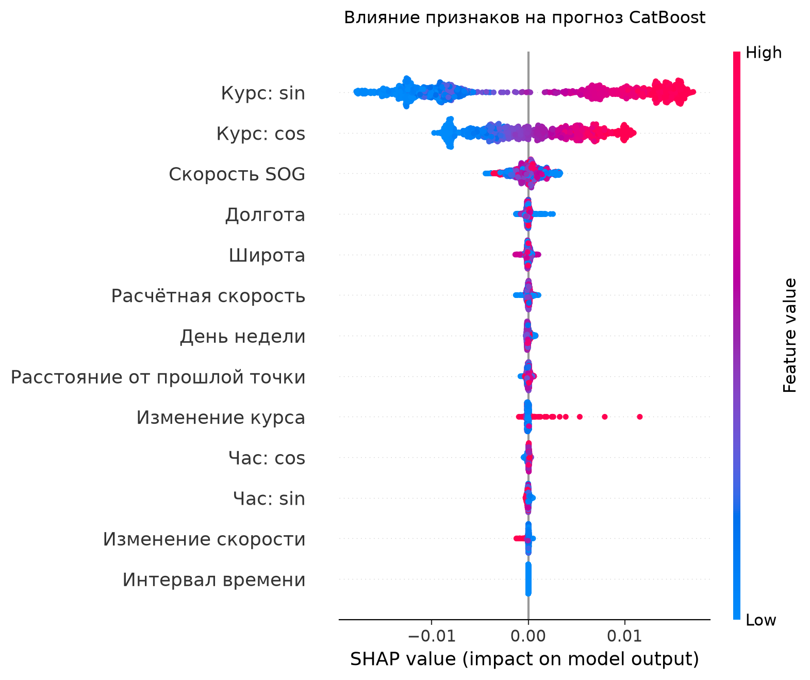
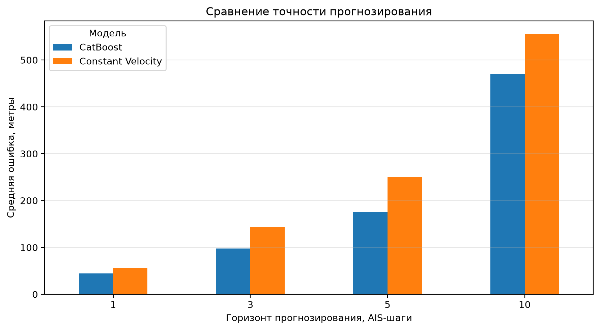
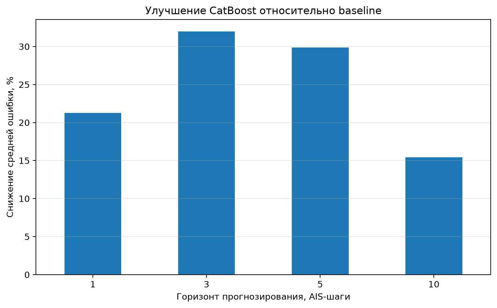
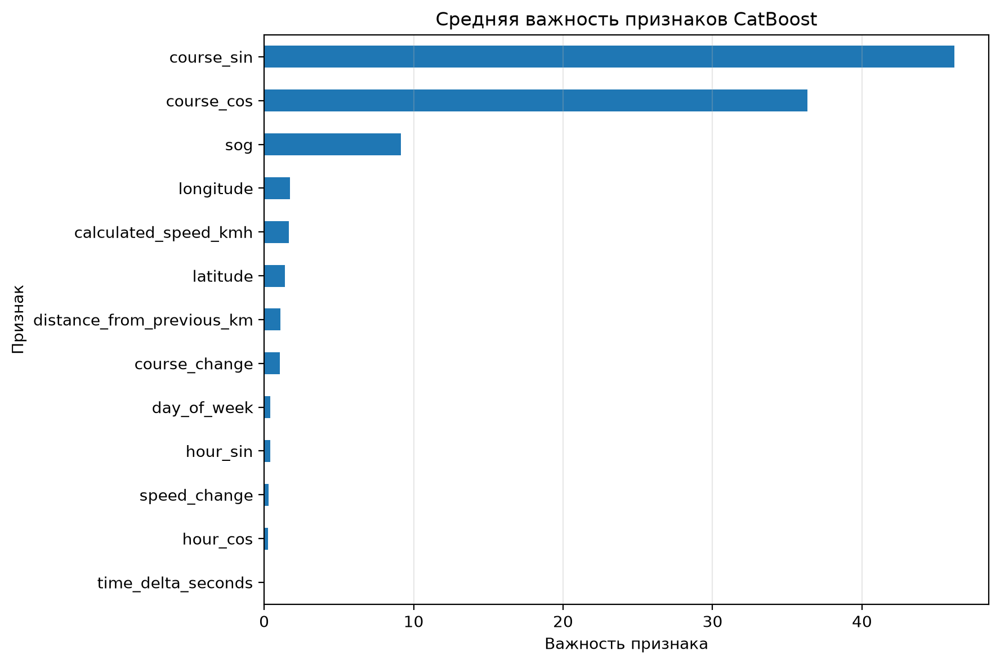

# 🚢 ShipTrajectoryAI

> Интеллектуальная система прогнозирования траекторий судов и обнаружения аномального навигационного поведения по AIS-данным.

ShipTrajectoryAI — end-to-end ML-проект, который обрабатывает реальные AIS-сообщения, восстанавливает маршруты судов, прогнозирует их дальнейшее положение и обнаруживает необычные участки движения.

---

## Основные результаты

| Показатель | Значение |
|---|---:|
| Обработано AIS-точек | 2 152 999 |
| Выделено траекторий | 12 591 |
| Уникальных судов | 2 078 |
| Средняя длина траектории | 171 точка |
| Максимальная длина траектории | 360 точек |
| Горизонты прогнозирования | 1, 3, 5 и 10 шагов |
| Аномалий Isolation Forest | около 1% |

CatBoost превзошёл модель постоянной скорости на всех исследованных горизонтах. Максимальное снижение средней ошибки составило **32% на горизонте 3 AIS-шага**.

---

## Возможности системы

- загрузка и проверка AIS-данных;
- преобразование исходных PKL-файлов;
- очистка координат, времени, скорости и курса;
- разделение данных на отдельные траектории;
- создание пространственных и навигационных признаков;
- прогнозирование будущего положения судна;
- многогоризонтное прогнозирование;
- сравнение CatBoost с физическим baseline;
- поиск известных аномалий по правилам;
- поиск неизвестных аномалий с Isolation Forest;
- интерпретация CatBoost через Feature Importance и SHAP;
- визуализация траекторий, прогнозов и аномалий;
- интерактивное приложение Streamlit.

---

## Постановка задачи

AIS — автоматическая идентификационная система, через которую суда передают информацию о своём движении:

- идентификатор MMSI;
- координаты;
- время сообщения;
- скорость относительно земли SOG;
- курс относительно земли COG;
- тип судна.

Реальные AIS-данные могут содержать пропуски, ошибки координат, временные разрывы и нетипичные изменения движения.

Цель проекта — разработать понятную ML-систему, способную:

1. подготовить исторические AIS-данные;
2. сформировать отдельные маршруты;
3. спрогнозировать будущие координаты;
4. обнаружить аномальное навигационное поведение;
5. визуально и численно объяснить результат.

---

## Архитектура

~~~text
AIS-данные
    |
    v
Загрузка и проверка структуры
    |
    v
Очистка и сортировка
    |
    v
Формирование отдельных траекторий
    |
    v
Создание навигационных признаков
    |
    +--------------------------------+
    |                                |
    v                                v
Прогнозирование                 Поиск аномалий
    |                                |
    + Constant Velocity              + Rule-based
    + CatBoost                       + Isolation Forest
    |                                |
    +----------------+---------------+
                     |
                     v
       Метрики и интерпретация
                     |
                     v
          Streamlit-приложение
~~~

---

## Данные

В проекте используется набор AIS-траекторий из датских вод, подготовленный для исследований аномального поведения судов.

Исходные данные хранятся в последовательности Pickle-объектов. Для проекта реализован собственный конвертер, который:

1. последовательно считывает все объекты;
2. преобразует каждую траекторию в таблицу;
3. добавляет `trajectory_id`;
4. объединяет траектории;
5. преобразует Unix timestamp в дату и время;
6. сохраняет подготовленный CSV.

Исходный набор не включён в Git-репозиторий из-за большого размера.

---

## Подготовка данных

Во время предобработки выполняются:

- унификация названий столбцов;
- преобразование времени;
- преобразование числовых полей;
- удаление пропущенных координат;
- проверка диапазонов широты и долготы;
- фильтрация невозможной скорости;
- удаление дубликатов;
- сортировка по траектории и времени;
- предотвращение смешивания разных маршрутов одного судна.

Особенно важно, что признаки рассчитываются внутри `trajectory_id`, а не только по `mmsi`. Это исключает ложные скачки между разными маршрутами одного и того же судна.

---

## Навигационные признаки

Для прогнозирования и поиска аномалий рассчитываются:

| Признак | Назначение |
|---|---|
| `latitude` | текущая широта |
| `longitude` | текущая долгота |
| `sog` | скорость относительно земли |
| `cog` | курс относительно земли |
| `speed_change` | изменение скорости |
| `course_change` | минимальное изменение курса |
| `distance_from_previous_km` | расстояние от предыдущей точки |
| `calculated_speed_kmh` | скорость, рассчитанная по координатам |
| `time_delta_seconds` | интервал между AIS-сообщениями |
| `hour` | час наблюдения |
| `day_of_week` | день недели |

### Циклическое кодирование курса

Курс является циклической величиной: направления 1° и 359° почти совпадают, хотя численно отличаются на 358°.

Поэтому для CatBoost используются:

~~~python
course_sin = sin(course)
course_cos = cos(course)
~~~

Аналогично кодируется час суток.

---

## Прогнозирование траекторий

### Constant Velocity

Baseline-модель предполагает, что судно продолжит движение с тем же смещением, которое наблюдалось между двумя последними точками.

Для горизонта `h`:

~~~text
predicted_position =
current_position + last_displacement * h
~~~

Эта модель проста, интерпретируема и служит точкой отсчёта.

### CatBoost

Для каждой будущей точки обучаются две модели:

- прогноз изменения широты;
- прогноз изменения долготы.

Модель предсказывает смещение относительно текущей позиции:

~~~text
predicted_latitude  = latitude  + predicted_delta_latitude
predicted_longitude = longitude + predicted_delta_longitude
~~~

Такой подход лучше соответствует физике движения, чем прогноз абсолютных координат.

---

## Результаты прогнозирования

Средняя географическая ошибка рассчитана по формуле гаверсинуса.

| Горизонт | Constant Velocity | CatBoost | Снижение ошибки |
|---:|---:|---:|---:|
| 1 AIS-шаг | 56,4 м | 44,4 м | 21,3% |
| 3 AIS-шага | 143,8 м | 97,9 м | 32,0% |
| 5 AIS-шагов | 250,6 м | 175,8 м | 29,8% |
| 10 AIS-шагов | 555,7 м | 469,9 м | 15,4% |

### Вывод

CatBoost превосходит baseline на всех исследованных горизонтах.

Наибольший выигрыш получен на горизонтах 3 и 5 AIS-шагов. На горизонте 10 шагов ошибка возрастает из-за накопления неопределённости: судно может изменить скорость или курс.

CatBoost лучше baseline в среднем, но на отдельных точках Constant Velocity может оказаться точнее. Это отображается в интерфейсе и рассматривается как ограничение модели, а не скрывается.

---

## Метрики

В проекте рассчитываются:

- средняя географическая ошибка;
- медианная ошибка;
- RMSE;
- 90-й и 95-й процентили;
- ADE — средняя ошибка по траектории;
- FDE — ошибка конечного прогнозируемого положения.

Разделение обучающих и тестовых данных выполняется по целым `trajectory_id`. Одна траектория не попадает одновременно в обучение и тестирование.

---

## Обнаружение аномалий

### Rule-based detector

Интерпретируемый метод обнаруживает:

- необычно высокую скорость;
- резкое изменение курса;
- возможный скачок координат;
- большой временной разрыв.

На исследуемой выборке основными срабатываниями были резкие изменения курса свыше установленного порога.

### Isolation Forest

Isolation Forest используется для поиска редких комбинаций признаков без размеченных меток.

Признаки модели:

- SOG;
- изменение скорости;
- изменение курса;
- расстояние между точками;
- расчётная скорость;
- временной интервал.

Модель выделила 162 точки, то есть около 1% анализируемых наблюдений.

Среднее изменение курса:

- нормальные точки — около 1,1°;
- аномальные точки — около 95,4°.

Это показывает, что алгоритм самостоятельно выделил резкие и нетипичные манёвры.

Важно: статистическая аномалия не обязательно означает опасное или незаконное поведение. Она указывает на участок, который требует дополнительного анализа.

---

## Интерпретация CatBoost

В проекте используются два способа интерпретации:

1. встроенная важность признаков CatBoost;
2. SHAP.

Наиболее важными оказались:

- направление движения, представленное `course_sin` и `course_cos`;
- скорость SOG;
- текущие координаты;
- параметры предыдущего перемещения.

Это соответствует физическому смыслу задачи: будущее положение судна прежде всего зависит от направления и скорости.

### SHAP

SHAP показывает вклад признаков не только в среднем, но и для отдельных прогнозов.

---

## Сравнение моделей

---

## Важность признаков

---

## Streamlit-приложение

Приложение содержит несколько функциональных страниц.

### Основная страница

- загрузка CSV;
- выбор траектории;
- карта маршрута;
- графики скорости и курса;
- таблица найденных аномалий.

### Model Comparison

- сравнение ошибок моделей;
- процент улучшения CatBoost;
- итоговая таблица;
- интерактивная важность признаков.

### Anomaly Detection

- выбор Rule-based или Isolation Forest;
- выбор траектории;
- карта аномальных точек;
- таблица подозрительных наблюдений;
- сравнение признаков нормальных и аномальных точек.

### Trajectory Forecast

- выбор горизонта;
- выбор тестовой траектории;
- выбор момента прогнозирования;
- текущая позиция;
- прогноз CatBoost;
- фактическая будущая позиция;
- ошибка CatBoost и baseline.

### About Project

- цель проекта;
- архитектура;
- описание методов;
- основные результаты;
- ограничения.

---

## Структура проекта

~~~text
ShipTrajectoryAI/
├── app/
│   ├── app.py
│   └── pages/
│       ├── 1_Model_Comparison.py
│       ├── 2_Anomaly_Detection.py
│       ├── 3_Trajectory_Forecast.py
│       └── 4_About_Project.py
├── data/
│   ├── raw/
│   └── processed/
├── models/
│   ├── catboost_multihorizon/
│   ├── isolation_forest.joblib
│   └── isolation_scaler.joblib
├── reports/
│   ├── figures/
│   └── tables/
├── src/
│   ├── anomaly/
│   ├── data/
│   ├── features/
│   ├── models/
│   ├── preprocessing/
│   └── visualization/
├── config.yaml
├── pyproject.toml
├── requirements.txt
└── README.md
~~~

---

## Установка

### Windows PowerShell

~~~powershell
git clone https://github.com/Kifirchik999/ShipTrajectoryAI.git
Set-Location "ShipTrajectoryAI"

python -m venv .venv
.\.venv\Scripts\Activate.ps1

python -m pip install --upgrade pip
pip install -r requirements.txt
~~~

---

## Запуск приложения

~~~powershell
streamlit run app\app.py
~~~

После запуска приложение будет доступно по адресу:

~~~text
http://localhost:8501
~~~

---

## Воспроизведение экспериментов

### Преобразование Pickle

~~~powershell
python src\data\convert_pickle.py
~~~

### Создание демонстрационной выборки

~~~powershell
python src\data\create_sample.py
~~~

### Многогоризонтный baseline

~~~powershell
python src\models\evaluate_multihorizon.py
~~~

### Обучение и оценка CatBoost

~~~powershell
python src\models\evaluate_catboost.py
~~~

### Обучение Isolation Forest

~~~powershell
python src\anomaly\train_isolation_forest.py
~~~

### SHAP-анализ

~~~powershell
python src\models\explain_shap.py
~~~

### Создание графиков

~~~powershell
python src\visualization\create_model_report.py
~~~

---

## Технологии

- Python;
- pandas;
- NumPy;
- scikit-learn;
- CatBoost;
- SHAP;
- Plotly;
- Matplotlib;
- Streamlit;
- joblib.

---

## Ограничения

- ошибка возрастает при увеличении горизонта;
- модель обучена на исторических данных конкретного региона;
- выборка для интерфейса меньше полного набора;
- статистический выброс не обязательно является опасным событием;
- текущая модель не учитывает погоду, глубину, береговую линию и взаимодействие судов;
- прогноз строится по отдельным траекториям, без моделирования окружающего трафика.

---

## Возможные улучшения

- прогноз доверительной области вместо одной точки;
- учёт типа и размеров судна;
- добавление погодных данных;
- учёт береговой линии и судоходных каналов;
- оценка риска столкновения;
- прогноз взаимодействия нескольких судов;
- последовательные модели GRU или Transformer;
- потоковая обработка AIS-сообщений;
- развёртывание приложения в облаке.

---

## Практический результат

Разработана законченная ML-система, объединяющая:

- обработку реальных геопространственных данных;
- восстановление маршрутов;
- многогоризонтное прогнозирование;
- сравнение ML-модели с baseline;
- ненадзорный поиск аномалий;
- интерпретацию модели;
- интерактивную визуализацию.

Проект демонстрирует полный цикл машинного обучения: от анализа исходного формата данных до рабочего пользовательского приложения.

---

## Автор

**Куанаш Ержанов**

